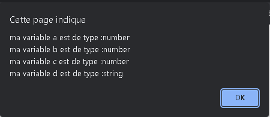

# Cours de Javascript
##<center>Introduction au JavaScript</center>

<p>JavaScript est un langage de programmation de scripts principalement employé dans les pages web interactives et à ce titre est une partie essentielle des applications web. Avec les langages HTML et CSS, JavaScript est au cœur des langages utilisés par les développeurs web3. Une grande majorité des sites web l'utilisent4, et la majorité des navigateurs web disposent d'un moteur JavaScript5 pour l'interpréter.</p>
##<center>Qu'est-ce qu'une variable</center>
<p>Une variable est un conteneur servant à stocker des informations de manière temporaire, comme une chaine de caractères (un texte) ou un nombre par exemple.

Le propre d’une variable est de pouvoir varier, c’est-à-dire de pouvoir stocker différentes valeurs au fil du temps et c’est cette particularité qui les rend si utiles.

Notez bien déjà qu’une variable en soi et la valeur qu’elle va stocker sont deux éléments différents et qui ne sont pas égaux. Encore une fois, une variable n’est qu’un conteneur. Vous pouvez imaginer une variable comme une boite dans laquelle on va pouvoir placer différentes choses au cours du temps.

Les variables sont l’une des constructions de base du JavaScript et vont être des éléments qu’on va énormément utiliser. Nous allons illustrer leur utilité par la suite.</p>

##Les types de variables
```javascript
var maChaine = new String("exemple");
var a = 42;
var b = 4.2;
var c = -42;
var d = "42";
alert ("ma variable a est de type :" + typeof (a) +
 "\nma variable b est de type :" + typeof (b) +
  "\nma variable c est de type :" + typeof (c) +
   "\nma variable d est de type :" + typeof (d)); 
``` 



```
var machaine = "exemple";
var maChaine = new String("exemple");

alert ("ma variable maChaine est de type :" + typeof (maChaine) +
"\nma variable machaine est de type : " + typeof (machaine));
```
 
```
var n = null;
var u = undefined;
var nn = NaN;

alert ("ma variable n est de type :" + typeof (n) +
"\nma variable n est de type :" + typeof (u) +
"\nma variable nn est de type : " + typeof (nn));
```
 

 ##Les règles de déclaration des variables en JavaScript

 <p>Une variable est donc un conteneur ou un espace de stockage temporaire qui va pouvoir stocker une valeur. Lorsqu’on stocke une valeur dans une variable, on dit également qu’on assigne une valeur à une variable.

Pour pouvoir utiliser les variables et illustrer leur intérêt, il va déjà falloir les créer. Lorsqu’on crée une variable en JavaScript, on dit également qu’on « déclare » une variable.

Pour déclarer une variable en JavaScript, nous allons devoir utiliser le mot clef var ou le mot clef let (nous allons expliquer la différence entre les deux dans la suite de cette leçon) suivi du nom qu’on souhaite donner à notre variable.

Concernant le nom de nos variables, nous avons une grande liberté dans le nommage de celles-ci mais il y a quand même quelques règles à respecter :

Le nom d’une variable doit obligatoirement commencer par une lettre ou un underscore (_) et ne doit pas commencer par un chiffre ;
Le nom d’une variable ne doit contenir que des lettres, des chiffres et des underscores mais pas de caractères spéciaux ;
Le nom d’une variable ne doit pas contenir d’espace.
De plus, notez que le nom des variables est sensible à la casse en JavaScript. Cela signifie que l’usage de majuscules ou de minuscules avec un même nom va permettre de définir des variables différentes. Par exemple, les noms texte, TEXTE et tEXTe vont pouvoir définir des variables différentes.

Enfin, sachez qu’il existe des noms « réservés » en JavaScript. Vous ne pouvez pas utiliser ces noms comme noms pour vos variables, tout simplement car le langage JavaScript les utilise déjà pour désigner différents éléments intégrés au langage. Nous verrons ces différents noms au fil de ce cours.

Vous pouvez également noter qu’on utilise généralement la convention lower camel case pour définir les noms de variable en JavaScript. Cette convention stipule simplement que lorsqu’un nom de variable est composé de plusieurs mots, on colle les mots ensemble en utilisant une majuscule pour chaque mot sauf le premier. Par exemple, si je décide de nommer une variable « monage » j’écrirai en JavaScript let monAge ou var monAge.

Ci-dessous, on crée nos deux premières variables en utilisant le mot clef let dans notre fichier cours.js :</p>


<p>Nos deux premières variables sont désormais créées. Cependant, elles ne stockent aucune valeur pour le moment.</p>

##Initialiser une variable

<p>Lorsqu’on assigne une valeur pour la première fois à une variable, c’est-à-dire lorsqu’on stocke une valeur dans une variable qui n’en stockait pas encore, on dit également qu’on initialise une variable.

On va pouvoir initialiser une variable après l’avoir déclarée ou au moment de sa déclaration. Les deux façons de faire sont équivalentes en termes de résultat mais il est plus rapide (en termes d’écriture de code) d’initialiser une variable lors de sa déclaration puisque cela nous va nous éviter d’avoir à réécrire le nom de la variable.

Pour initialiser une variable, on utilise l’opérateur = qui est dans ce cas non pas un opérateur d’égalité mais un opérateur d’assignation ou d’affectation comme ceci :</p>


<p>Ce point est un point très important à retenir pour éviter les confusions futures et donc je le répète : le signe = ne possède pas du tout la même signification que le « égal » mathématique que vous utilisez dans la vie de tous les jours.

Ici, c’est un opérateur d’affectation. Il sert à indiquer qu’on affecte (ou « assigne » ou encore « stocke ») la valeur à droite du signe dans le conteneur à gauche de celui-ci. Encore une fois, la variable n’est pas « égale » à sa valeur.

Vous pouvez également noter deux autres choses intéressantes dans le code ci-dessus : tout d’abord, vous pouvez voir que le mot clef let (ou var) n’est utilisé et ne doit être utilisé que pour déclarer une variable. Lorsqu’on manipule une variable ensuite, on se contente d’utiliser son nom.

Ensuite, vous remarquez qu’on utilise des apostrophes droits ou guillemets simples pour entourer la valeur « Pierre » mais pas pour la valeur « 29 ». Cela est dû au fait que « Pierre » est une valeur textuelle tandis que « 29 » est un chiffre et ces valeurs ne vont pas pouvoir être manipulées de la même façon en JavaScript. Nous verrons cela en détail dans la prochaine leçon.</p>

##Modifier la valeur stockée dans une variable

<p>Le propre d’une variable et l’intérêt principal de celles-ci est de pouvoir stocker différentes valeurs.

Pour affecter une nouvelle valeur dans une variable déjà initialisée, on va se contenter d’utiliser à nouveau l’opérateur d’affectation =.

En faisant cela, la nouvelle valeur va venir écraser l’ancienne valeur stockée qui sera alors supprimée.
</p>


<p>Ici, on commence par stocker la valeur « Pierre » dans notre variable prenom puis on affecte ensuite la valeur « Mathilde » à notre variable. Cette nouvelle valeur vient écraser l’ancienne car une variable ne peut stocker qu’une valeur à la fois.</p>

##La différence entre les mots clefs let et var

<p>Pourquoi possède-t-on deux mots clefs différents pour déclarer des variables en JavaScript ? Cela provient du fait qu’aucun langage n’est parfait ainsi que du fait que les langages informatiques ne sont pas figés mais sont des langages qui évoluent beaucoup et rapidement.

En effet, en informatique, l’augmentation rapide des possibilités (grâce à des connexions plus rapides et à des matériaux de plus en plus performants) pousse les langages à évoluer et notamment à se complexifier et à développer de nouvelles fonctionnalités pour exploiter ces possibilités.

Cette évolution fait que parfois certains langages changent de philosophie de design et modifient certains de leurs composants lorsque ceux-ci deviennent inadaptés.

En effet, en informatique, vous devez absolument comprendre que tout est toujours en mouvement et que ce qui était vrai ou ce qui était considéré comme une bonne pratique il y a 10, 5, 2 ans en arrière ne l’est potentiellement plus aujourd’hui.

Le problème ici est que les différents langages qui ont passé l’épreuve du temps ne peuvent pas du jour au lendemain abandonner complètement certains composants et en définir de nouveaux complètement différents car cela serait, dans le cas d’une langage populaire comme le JavaScript, dramatique pour le web en général.

Effectivement, il faut ici bien comprendre que lorsqu’on crée un site web, on utilise les technologies du moment. Que se passerait il si certaines fonctionnalités d’un langage étaient brutalement abandonnées et du jour au lendemain plus supportées et donc plus comprises par les navigateurs (dans le cas du JavaScript) qui sont chargées de les exécuter ? La plupart des sites accessibles seraient complètement bogués voire inaccessibles.

Pour cette raison, lorsqu’un langage souhaite faire évoluer ses composants, il doit tenir compte de son héritage et se débrouiller pour faire cohabiter les anciennes fonctionnalités avec les nouvelles au moins le temps que la majorité des propriétaires de sites aient le temps d’implémenter les nouvelles fonctionnalités à la place des anciennes.

Comme vous vous en doutez, dans la plupart des cas, cela prend des années et ce sont généralement dans les faits les navigateurs principaux (Chrome, Firefox, Safari, Explorer) qui « décident » de quand une fonctionnalité est obsolète et qui décident qu’à partir de telle date elle ne sera plus supportée.

Ainsi, la coexistence des mots clefs var et let en JavaScript est due avant tout à ce souci d’héritage du langage.

Pour être tout à fait précis, lorsque le JavaScript a été créé et jusqu’à il y a quelques années, nous n’avions accès qu’au mot clef var qu’on devait utiliser pour déclarer nos variables.

Finalement, les créateurs du JavaScript ont fini par penser que le mot clef var pouvait porter à confusion et ont créé un nouveau mot clef pour déclarer les variables : le mot clef let.

En même temps qu’un nouveau mot clef a été créé, les créateurs du JavaScript en ont profité pour résoudre quelques problèmes liés à la déclaration de variables en utilisant var, ce qui fait que let ne va pas nous permettre de créer des variables de la même façon que var.

Il existe 3 grandes différences de comportement entre les variables déclarées avec var et avec let que nous allons illustrer immédiatement.</p>

##La remontée ou « hoisting » des variables

<p>Lorsqu’on utilise la syntaxe avec var, on n’est pas obligé de déclarer la variable avant de la manipuler dans le code, on peut très bien effectuer des manipulations en haut du code et la déclarer en fin de code.

Cela est possible car le JavaScript va traiter les déclarations de variables effectuées avec var avant le reste du code JavaScript. Ce comportement est appelé remontée ou hoisting.

Ce comportement a été jugé comme inadapté dans les versions récentes de JavaScript et a donc été corrigé dans la déclaration de variables avec let : les variables utilisant la syntaxe let doivent obligatoirement être déclarées avant de pouvoir être utilisées.

Le but de ce comportement est de pousser les développeurs à créer des scripts plus compréhensibles et plus clairs en apportant de la structure au code avec notamment la déclaration des différentes variables au début de chaque script.

</p>


##La redéclaration de variables

<p>Avec l’ancienne syntaxe var, on avait le droit de déclarer plusieurs fois une même variable en utilisant à chaque fois var (ce qui avait pour effet de modifier la valeur stockée).

La nouvelle syntaxe avec let n’autorise pas cela. Pour modifier la valeur stockée dans une variable avec la nouvelle syntaxe, il suffit d’utiliser le nom de la variable et de lui affecter une autre valeur.

Cette décision a été prise une nouvelle fois pour des raisons de clarté et de pertinence du code. En effet, il n’y a aucun intérêt à redéfinir une même variable plusieurs fois.

</p>


##La portée des variables

<p>La « portée » d’une variable désigne l’endroit où cette variable va pouvoir être utilisée dans un script. Il est un peu tôt pour vous expliquer ce concept puisque pour bien le comprendre il faut déjà savoir ce qu’est une fonction.

Nous reparlerons donc de cette portée des variables lorsque nous aborderons les fonctions en JavaScript.

Vous pouvez pour le moment retenir si vous le souhaitez que les variables déclarées avec var et celles avec let au sein d’une fonction ne vont pas avoir la même portée, c’est-à-dire qu’on ne va pas pouvoir les utiliser aux mêmes endroits</p>

##Le choix de la déclaration des variables : plutôt avec let ou plutôt avec var

<p>La syntaxe de déclaration des variables avec let correspond à la nouvelle syntaxe. La syntaxe avec var est l’ancienne syntaxe qui est vouée à disparaitre.

Vous devriez donc aujourd’hui toujours utiliser le mot clef let pour déclarer vos variables et c’est le mot clef qu’on utilisera dans ce cours.</p>

##Quelle utilité pour les variables en pratique ?

<p>Les variables vont être à la base de la plupart de nos scripts JavaScript. En effet, il va être très pratique de stocker différents types d’informations dans les variables pour ensuite manipuler simplement ces informations notamment lorsqu’on n’a pas accès à ces informations lorsqu’on crée le script.

Par exemple, on va pouvoir demander à des utilisateurs de nous envoyer des données grâce à la fonction (ou la méthode pour être tout à fait précis mais nous verrons cela plus tard) prompt(). Lorsqu’on écrit notre script avec notre fonction prompt(), on ne sait pas encore ce que les utilisateurs vont nous envoyer comme données. Dans ce cas, notre script va être créé de manière à ce que les données envoyées soient stockées lors de leur envoi dans des variables qu’on définit. Cela nous permet déjà de pouvoir manipuler les dites variables et par extension les données qu’elles vont stocker.

De même, le fait qu’une même variable puisse stocker plusieurs valeurs dans le temps va être extrêmement utile dans de nombreuses situations. Vous vous souvenez de l’horloge créée au début de ce cours ? Pour créer cette horloge et pour afficher l’heure actuelle, il a fallu utiliser une variable.

Le principe est ici le suivant : je vais chercher l’heure actuelle toutes les secondes et je stocke cette heure dans ma variable que j’affiche ensuite.

A ce propos, il existe de nombreux moyens d’afficher le contenu d’une variable en JavaScript, que ce soit via la console JavaScript du navigateur, en utilisant une fonction alert() ou encore en insérant le contenu de notre variable au sein du contenu HTML de notre page. Nous verrons chacune de ces méthodes en détail en temps et en heure, au fil de ce cours.</p>

## Tableaux
<p>Pour créer un tableau vous devez placer une ligne de tirets (-) sous la ligne d'entête et séparer les colonnes avec des |. Vous pouvez aussi préciser l'alignement en utilisant des :</p>

```
| Aligné à gauche | Centré         | Aligné à droite |
| :-------------- | :------------: | -----: |
| Aligné à gauche | Ce texte       | Aligné à droite |
| Aligné à gauche | est            | Aligné à droite |
| Aligné à gauche | centré         | Aligné à droite |
```
| Aligné à gauche | Centré         | Aligné à droite |
| :-------------- | :------------: | -----: |
| Aligné à gauche | Ce texte       | Aligné à droite |
| Aligné à gauche | est            | Aligné à droite |
| Aligné à gauche | centré         | Aligné à droite |


## Les codes raccourcis (shortcodes)

### Alignements

<p>La syntaxe markdown seule ne permet pas d’aligner du texte mais Grav inclus quelques shortcodes :</p>

```
[left]Texte aligné à gauche[/left]
[center]Texte centré[/center]
[right]Texte algné à droite[/right]
```

Après il reste possible d’utiliser du HTML et les classes CSS de Bootstrap :

```
<p class="text-center">Texte centré</p>
```

Les classes de Bootstrap sont :
```
 text-left|text-center|text-right|text-justify
```
### Couleurs

La syntaxe markdown seule ne permet pas non plus d’utiliser des couleurs mais vous pouvez utiliser ce shortcode :

```
Texte normal suivi d’un [color=#26B260]texte coloré en vert[/color] dans un paragraphe.
```
Vous pouvez utiliser du code html :

```
Texte normal suivi d’un <span style="color: #26B260">texte coloré en vert</span> dans un paragraphe.
```

/Les classes Bootstrap de couleurs « contextuelles » sont aussi disponibles :)

text-muted
text-primary
text-info
text-success
text-warning
text-danger

et également pour l’arrière plan.
 Exemple:
```
Texte normal suivi d’un <span class="bg-info text-success">texte coloré en vert sur fond bleu</span> dans un paragraphe.
```

##Les types de données en JavaScript

Les variables JavaScript vont pouvoir stocker différents types de valeurs, comme du texte ou un nombre par exemple. Par abus de langage, nous parlerons souvent de « types de variables » JavaScript.
En JavaScript, contrairement à d’autres langages de programmation, nous n’avons pas besoin de préciser à priori le type de valeur qu’une variable va pouvoir stocker. Le JavaScript va en effet automatiquement détecter quel est le type de la valeur stockée dans telle ou telle variable, et nous allons ensuite pouvoir effectuer différentes opérations selon le type de la variable, ce qui va s’avérer très pratique pour nous !

Une conséquence directe de cela est qu’on va pouvoir stocker différents types de valeurs dans une variable au fil du temps sans se préoccuper d’une quelconque compatibilité. Par exemple, une variable va pouvoir stocker une valeur textuelle à un moment dans un script puis un nombre à un autre moment.

En JavaScript, il existe 7 types de valeurs différents. Chaque valeur qu’on va pouvoir créer et manipuler en JavaScript va obligatoirement appartenir à l’un de ces types. Ces types sont les suivants :

```String``` ou « chaine de caractères » en français ;
```Number``` ou « nombre » en français ;
```Boolean``` ou « booléen » en français ;
```Null``` ou « nul / vide » en français;
```Undefined``` ou « indéfini » en français ;
```Symbol``` ou « symbole » en français ;
```Object``` ou « objet » en français ;

Ce que vous devez bien comprendre ici est que les données vont pouvoir être manipulées différemment en fonction de leur type et qu’il est donc essentiel de les connaitre pour créer des scripts fonctionnels.

var arrayNbr = [1, 2, 3];
var arrayStr = ["a", "b", "c"];

##Array.prototype.push()

La méthode push() ajoute un ou plusieurs éléments à la fin d'un tableau et retourne la nouvelle taille du tableau.

###Exemple interactif

 arrayNbr.push(4); //[1, 2, 3, 4] ajoute la valeur indiqué à la fin du tableau

###Array.prototype.pop()

###Exemple interactif

 arrayNbr.pop(); //[1, 2] retire la dernière valeur
 
 ##Array.prototype.shift()

 ###Exemple interactif
 
 arrayNbr.shift(); //[2, 3] retire la première valeur

##Array.prototype.unshift()

 ###Exemple interactif

 arrayNbr.unshift(0); //[0, 1, 2, 3] ajoute la valeur indiqué au début du tableau

##Array.prototype.concat()

 ###Exemple interactif

 arrayStr.concat("d"); //fusionne des tableaux sans changer les valeurs du tableau initial

##Array.prototype.join()

 ###Exemple interactif

 arrayStr.join('-'); // a-b-c joindre les valeurs du tableau sans changer les valeurs du tableau initial

##Array.prototype.slice()

###Exemple interactif

 arrayStr.slice(1); // ["b", "c"] retire le nombre d'éléments indiqué du tableau en partant du début sans changer les valeurs du tableau initial

 arrayStr.slice(-1); // ["b", "c"] retire le nombre d'éléments indiqué du tableau en partant du début et en comptant depuis la fin sans changer les valeurs du tableau initial

##Array.prototype.includes()

###Exemple interactif

 arrayStr.includes("c"); //true vérifie si la valeur existe

##Array.prototype.indexOf()

###Exemple interactif

 arrayStr.indexOf("c"); //2 renvoi le position (index) de la valeur dans le tableau

##Array.prototype.reduce()

###Exemple interactif

 arrayNbr.reduce((acc, cou)=> acc + cou ) //6 additionne tous les éléments du tableau

##Array.prototype.find()

###Exemple interactif

 arrayNbr.find(el => el > 2) //3 renvoie la valeur du premier élément trouvé dans le tableau qui respecte la condition
 arrayNbr.findIndex(el => el > 2) //2 renvoie l'index du premier élément trouvé dans le tableau qui respecte la condition
arrayNbr.map(el => el * 2); //[2, 4, 6] crée un nouveau tableau avec les résultats de l'appel d'une fonction fournie sur chaque élément du tableau appelant.
 arrayNbr.some(el => el > 2); //true passe le test implémenté par la fonction fournie. Elle renvoie un booléen indiquant le résultat du test.
 arrayNbr.filter(el => el > 1) // [2,3] renvoi tous les éléments qui respectent la condition
 arrayNbr.every(el => el > 1);
 arrayNbr.reverse();