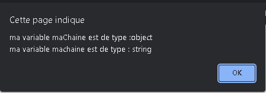

# Cours de Javascript
##<center>Introduction au JavaScript</center>

<p>JavaScript est un langage de programmation de scripts principalement employé dans les pages web interactives et à ce titre est une partie essentielle des applications web. Avec les langages HTML et CSS, JavaScript est au cœur des langages utilisés par les développeurs web3. Une grande majorité des sites web l'utilisent4, et la majorité des navigateurs web disposent d'un moteur JavaScript5 pour l'interpréter.</p>
##<center>Qu'est-ce qu'une variable</center>
<p>Une variable est un conteneur servant à stocker des informations de manière temporaire, comme une chaine de caractères (un texte) ou un nombre par exemple.

Le propre d’une variable est de pouvoir varier, c’est-à-dire de pouvoir stocker différentes valeurs au fil du temps et c’est cette particularité qui les rend si utiles.

Notez bien déjà qu’une variable en soi et la valeur qu’elle va stocker sont deux éléments différents et qui ne sont pas égaux. Encore une fois, une variable n’est qu’un conteneur. Vous pouvez imaginer une variable comme une boite dans laquelle on va pouvoir placer différentes choses au cours du temps.

Les variables sont l’une des constructions de base du JavaScript et vont être des éléments qu’on va énormément utiliser. Nous allons illustrer leur utilité par la suite.</p>

##Les types de variables
```javascript
var maChaine = new String("exemple");
var a = 42;
var b = 4.2;
var c = -42;
var d = "42";
alert ("ma variable a est de type :" + typeof (a) +
 "\nma variable b est de type :" + typeof (b) +
  "\nma variable c est de type :" + typeof (c) +
   "\nma variable d est de type :" + typeof (d)); 
``` 


```
var machaine = "exemple";
var maChaine = new String("exemple");

alert ("ma variable maChaine est de type :" + typeof (maChaine) +
"\nma variable machaine est de type : " + typeof (machaine));
```
 
```
var n = null;
var u = undefined;
var nn = NaN;

alert ("ma variable n est de type :" + typeof (n) +
"\nma variable n est de type :" + typeof (u) +
"\nma variable nn est de type : " + typeof (nn));
```
 

 ##Les règles de déclaration des variables en JavaScript

 <p>Une variable est donc un conteneur ou un espace de stockage temporaire qui va pouvoir stocker une valeur. Lorsqu’on stocke une valeur dans une variable, on dit également qu’on assigne une valeur à une variable.

Pour pouvoir utiliser les variables et illustrer leur intérêt, il va déjà falloir les créer. Lorsqu’on crée une variable en JavaScript, on dit également qu’on « déclare » une variable.

Pour déclarer une variable en JavaScript, nous allons devoir utiliser le mot clef var ou le mot clef let (nous allons expliquer la différence entre les deux dans la suite de cette leçon) suivi du nom qu’on souhaite donner à notre variable.

Concernant le nom de nos variables, nous avons une grande liberté dans le nommage de celles-ci mais il y a quand même quelques règles à respecter :

Le nom d’une variable doit obligatoirement commencer par une lettre ou un underscore (_) et ne doit pas commencer par un chiffre ;
Le nom d’une variable ne doit contenir que des lettres, des chiffres et des underscores mais pas de caractères spéciaux ;
Le nom d’une variable ne doit pas contenir d’espace.
De plus, notez que le nom des variables est sensible à la casse en JavaScript. Cela signifie que l’usage de majuscules ou de minuscules avec un même nom va permettre de définir des variables différentes. Par exemple, les noms texte, TEXTE et tEXTe vont pouvoir définir des variables différentes.

Enfin, sachez qu’il existe des noms « réservés » en JavaScript. Vous ne pouvez pas utiliser ces noms comme noms pour vos variables, tout simplement car le langage JavaScript les utilise déjà pour désigner différents éléments intégrés au langage. Nous verrons ces différents noms au fil de ce cours.

Vous pouvez également noter qu’on utilise généralement la convention lower camel case pour définir les noms de variable en JavaScript. Cette convention stipule simplement que lorsqu’un nom de variable est composé de plusieurs mots, on colle les mots ensemble en utilisant une majuscule pour chaque mot sauf le premier. Par exemple, si je décide de nommer une variable « monage » j’écrirai en JavaScript let monAge ou var monAge.

Ci-dessous, on crée nos deux premières variables en utilisant le mot clef let dans notre fichier cours.js :</p>
